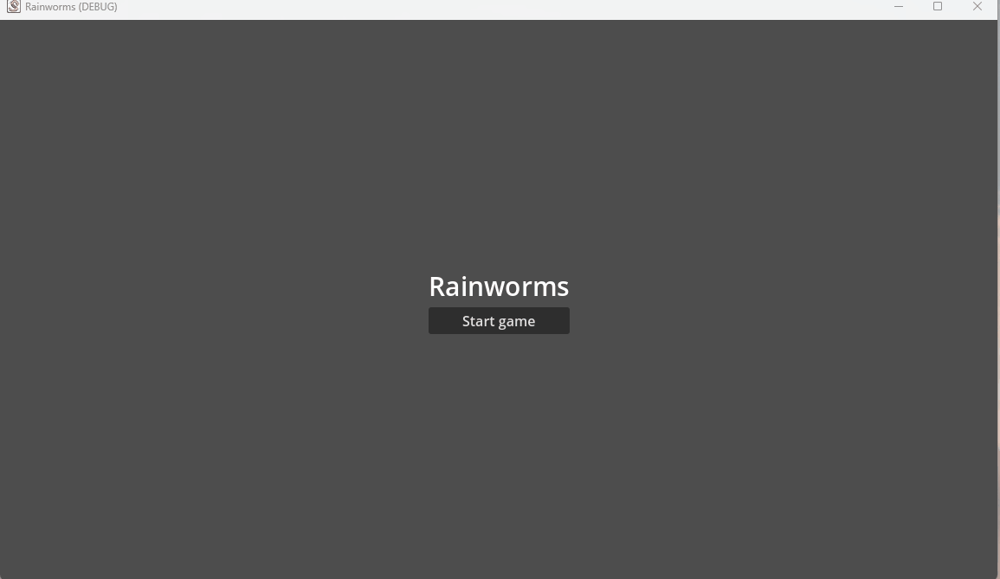

# Rainworms

A hobbyist clone of Regenwormen I made to learn Godot. 

There is a weird bug where: on the 1st attempt to keep the dices, the sprites are sometimes unresponsive to clicks. Not sure yet why and how to reproduce this. 

Assets used
* [Dice throwing animation](https://kicked-in-teeth.itch.io/dice-roll)
* Dice and tile sprites are made by Annick Paul for this project.
